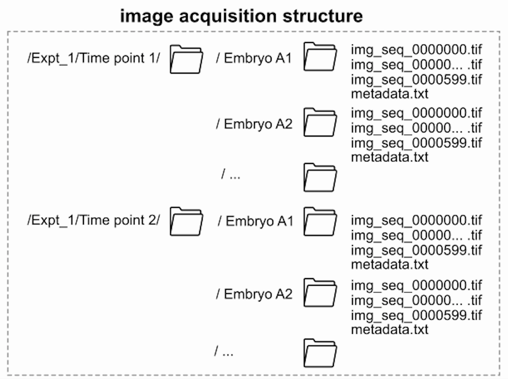

# EmbryoCV

### What is EmbryoCV?


EmbryoCV is a Python package developed by a team of scientists to quantify different biological aspects of developing organisms from video datasets. It forms part of the embryo-phenomics platform www.embryophenomics.org - a combination of open-source hardware and software for high-throughput and high-resolution quantification of aquatic embryos. 


The package EmbryoCV was developed to analyse the large long-term image datasets acquired using [OpenVIM](http://www.openVIM.org "OpenVIM homepage"), the hardware component of the embryo-phenomics platform [embryo-phenomics](http://www.embryophenomics.org "Embryo-phenomics homepage"). OpenVIM can generate high quality long-term video datasets of large numbers of aquatic embryos for extended periods of time. Consequently OpenVIM is a powerful tool for visualising and quanitfying the dynamic period of embryonic development in a way that is simply not possible with manual observation. 


However, the downside of this capability is the generation of vast quantities of video data and the extremely time consuming nature of manual analysis. It therefore becomes necessary to quanitfy only particular aspects of biological development, or to limit the scale of experiments for methodological, rather than biological reasons. EmbryoCV is the solution to this issue. It provides a high-throughput pipeline for measuring phenome-level responses of aquatic embryos with unprecedented temporal, spatial and functional resolution.


### What can EmbryoCV do?


Biological development is complex and dynamic and EmbryoCV has been designed to capture as much of this complexity as possible in the form of biologically relevant measures. These measurements form a powerful phenome-level dataset and owing to the capacity of OpenVIM to record many hundred embryos simultaneously, whilst also controlling the embryonic environment, these responses can be quantified in large numbers of aquatic embryos and in different environmental conditions.

EmbryoCV attempts to extract data on embryo size, shape, position and physiology from every frame for every embryo and these measures are integrated to form a multi-dimensional biologicaly relevant dataset.

  * Size
  * Shape
  * Position
  * Function
  * Movement rates
  * Physiological rates 


The final output of EmbryoCV is an XArray HDF5 dataset for each embryo. This is dynamically callable and can be used for focussed analysis downstream. Owing to the excellent capabilities of XArray, Pandas and Python in general the analysis and mining of the vast datsets produced by EmbryoCV are easily acheived. Alternatively export of data in more familiar formats such as csv are simply a command in the EmbryoCV workflow.


### How do I use EmbryoCV?
Python is platform independant and so EmbryoCV, although only tested on MacOS, should run on any system. EmbryoCV has a number of dependencies including OpenCV (image analysis), Pandas (data storage and processing), Numpy (numerical), SciKit (various), XArray (high-dimensional data storage), Matplotlib (visualisation), pyqtgraph (UI). EmbryoCV has been designed to run interactively using IPython - allowing users to dynamically query the outputs of particular functions during their analysis. More detailed information on setting up EmbryoCV on your system is available here. If users encounter issues they are encouraged to use the Google Group [embryo-phenomics Google Group](http://groups.google.com/forum/#!forum/embryo-phenomics "Embryo-phenomics user group")

EmbryoCV is intentionally simple to use, consisting of a small number of user callable functions. It has been developed to work with Micro-Manager datasets acquired as multiple image sequences of a number of embryos acquired over prolonged periods. The acquisition of such an image dataset is easily acheived using MicroManager and the process is described on the [OpenVIM](http://www.openVIM.org "OpenVIM homepage") site. 



Once a user has acquired such a dataset they can begin the analysis using EmbryoCV. EmbryoCV has been tested and optimised to work with two species Radix balthica - a freshwater gastropod and Orchestia gammarellus - a marine amphipod. However, EmbryoCV is easily extendible to different species and much of the functionality is intentionally species-independant. 

A user begins by setting up an 'instance' of EmbryoCV for their analysis. They must provide EmbryoCV the parent folder in which 
```
analysis = embryoPhenomics.embryoPhenomics('parentPath','mode','scale','exclude''species' dataFormat')
# parentPath = path to folder containing image dataset (Expt_1) in figure.
# mode = stage of analysis, either 'new' (a new analysis), 'resume' (restart an analysis), 'results' (load an experiment without the original image dataset - just using a set of Pandas results files) or 'xarray'(load an experiment using just the final output XArray datasets).
# scale = number of um per pixel.
# exclude = a list of user provided embryos to exclude from an analysis. e.g. exclude = 'A1' or exclude = ['A1,'A4',B8'].
# species = the species used. Currently 'rbathica' or 'orgammarellus' supported.
# dataFormat = is the dataformat normal. By default this is True. This offers the potential to work with image datasets structured differently.

```

If a user is initiating a 'new' experiment EmbryoCV will mine the imagedataset and both generate and save a results structure using information from the metadata of each image sequence, for each embryo. At this stage EmbryoCV also attempts to locate the embryo and the validateEggs function can be used to validate this. The user can visualise the ROIs for each image sequence and manually modify these if required. By default EmbryoCV locates the egg in just the first image of each image sequence and this is tranferred to all frames of the sequence. 
```
analysis.validateEggs()
```

Quantification of embryo physiology, position and shape is primarily performed during the quantifyAllEmbryos function which by default incorporates parallel processing. The process is partly species-dependant. For example 'rbalthica' is very mobile within its egg capsule and its size, shape and position can be quantified precisely. However, 'ogammarellus' fills its egg capsule and therefore some comparable measures are not posible. The blockwise frequency function however is the same and this underpins much of the downstream processes including quantificaiton of physiological rates and quantification of embryo health, among other measures. 
```
analysis.quantifyAllEmbryos()
```

Upto this stage of an analysis data are stored as a Pandas Data Panel for each embryo stored to disk via Pickle. This results format is stored in a ```phenomeData``` folder stored in the parentPath with the image dataset. However, accessing such data is slow and therefore the next stage of the analysis ```savePhenomeMeasuresForAllEmbryos``` incoporates the results files transferred to a more powerful and extendible structure and format using the XArray package. Another advangtage is that results can be called dynamically i.e. they do not be loaded by the user to access and query them. It is not uncommon for the results file for a single embryo to be many GB and therefore this optimisation is important for effective downstream processing and analysis. At this stage owing to the design of the EmbryoCV workflow it is no longer necessary to have the image dataset to proceed with the analysis. ```savePhenomeMeasuresForAllEmbryos``` sees the results files stored in a user defined location and the subsequent analytical steps do not require the image dataset.

```
analysis.savePhenomeMeasuresForAllEmbryos('pathToSave')
# pathToSave = User provided path to save XArray results files to
```

In addition to a change in the results files format and structure, this stage ```savePhenomeMeasuresForAllEmbryos``` also incoporates the important stage of blockwise frequency quantification. This is species-independant and faciliates many options for mining, quantification or classification of embryonic responses.

From this stage onwards EmbryoCV sees more focussed analyses targeted at quantifying particular traits or responses such as heart rate or classification of lethal end points. 

To quantify heart rate, the following scripts can be used. Output for all embryos is stored in a .npy file at the location savePath, together with a PDF summary for each embryo describing the model fitting. The ontogeny of heart function in Radix balthica follows a segmented relationship and consequently a segmented model is fitted, whereas for Orchestia gammarellus a linear model is used. 


``` 
analysis.measureHeartRateForAllEmbryos(savePath)
analysis.measureHeartRateForSpecificEmbryos(embryos,savePath)
# The measureHeartRate functions incorporate a large number of tunable parameters to optimise model fitting. See manual for more detail.
```


### How is EmbryoCV structured?
EmbryoCV has a modular internal structure, consisting of the modules dataHandling, imageAnalysis, eggUI, dataIntegration, dataAnalysis and the parent module EmbryoCV. However, this complexity is irrelevant to users unless they are looking to customise or develop EmbryoCV [More detailed information on the structure of EmbryoCV](programStructure.md).


