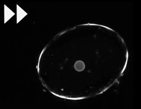
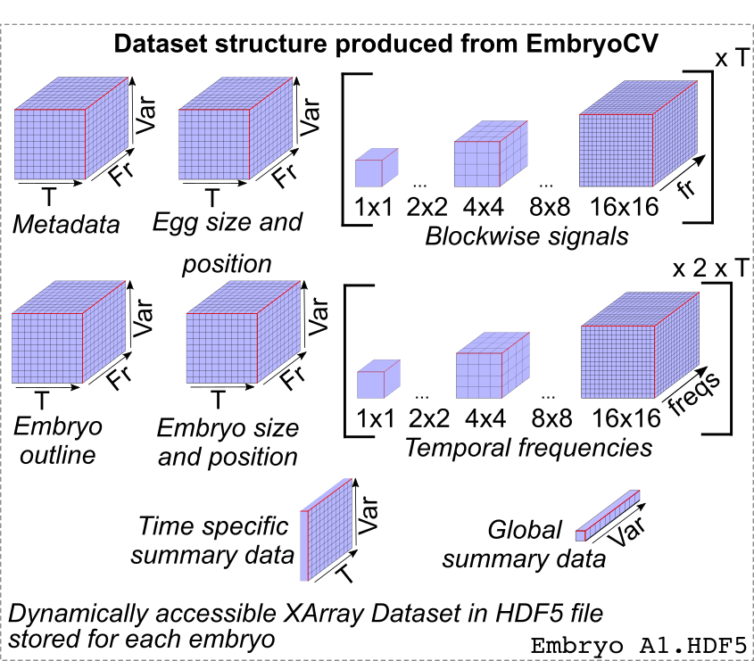

### What is EmbryoCV?

EmbryoCV is a Python package developed by a team of scientists to quantify different biological aspects of developing organisms from video datasets. It forms part of the embryo-phenomics platform www.embryophenomics.org - a combination of open-source hardware and software for high-throughput and high-resolution quantification of aquatic embryos. 

The package EmbryoCV was developed to analyse the large long-term image datasets acquired using [OpenVIM](https://www.openVIM.org "OpenVIMs Homepage"), the hardware component of the embryo-phenomics platform [embryo-phenomics](https://www.embryophenomics.org "embryo-phenomics Homepage"). OpenVIM can generate high quality long-term video datasets of large numbers of aquatic embryos for extended periods of time. Consequently OpenVIM is a powerful tool for visualising and quanitfying the dynamic period of embryonic development in a way that is simply not possible with manual observation. 

However, the downside of this capability is the generation of vast quantities of video data and the extremely time consuming nature of manual analysis. It therefore becomes necessary to quanitfy only particular aspects of biological development, or to limit the scale of experiments for methodological, rather than biological reasons. EmbryoCV is the solution to this issue. It provides a high-throughput pipeline for measuring phenome-level responses of aquatic embryos with unprecedented temporal, spatial and functional resolution.

### What can EmbryoCV do?

Biological development is complex and dynamic and EmbryoCV has been designed to capture as much of this complexity as possible in the form of biologically relevant measures. These measurements form a powerful phenome-level dataset and owing to the capacity of OpenVIM to record many hundred embryos simultaneously, whilst also controlling the embryonic environment, these responses can be quantified in large numbers of aquatic embryos and in different environmental conditions.

EmbryoCV attempts to extract data on embryo size, shape, position and physiology from every frame for every embryo and these measures are integrated to form a multi-dimensional biologicaly relevant dataset.

* Size
* Shape
* Position
* Function
* Movement rates
* Physiological rates 

The final output of EmbryoCV is an XArray HDF5 dataset for each embryo. This is dynamically callable and can be used for focussed analysis downstream. Owing to the excellent capabilities of XArray, Pandas and Python in general the analysis and mining of the vast datsets produced by EmbryoCV are easily acheived. Alternatively export of data in more familiar formats such as csv are simply a command in the EmbryoCV workflow.

### How do I use EmbryoCV?
EmbryoCV is intentionally simple to use, consisting of a small number of user callable functions. A user begins by setting up an 'instance' of EmbryoCV for their analysis. They must provide EmbryoCV the ...
..
..

Python is platform independant and so EmbryoCV, although only tested on MacOS, should run on any system given that Python is supported on Windows and Linux. EmbryoCV has a number of dependencies including OpenCV (image analysis), Pandas (data storage and processing), Numpy (numerical), SciKit (various), XArray (high-dimensional data storage), Matplotlib (visualisation), pyqtgraph (UI). EmbryoCV has been designed to run interactively using IPython - allowing users to dynamically query the outputs of particular functions during their analysis. More detailed information on setting up EmbryoCV on your system is available here. If users encounter issues they are encouraged to use the Google Group [embryo-phenomics Google Group]("https://groups.google.com/forum/#!forum/embryo-phenomics")

### How do I use EmbryoCV?

### How is EmbryoCV structured?
EmbryoCV has a modular internal structure, consisting of the modules dataHandling, imageAnalysis, eggUI, dataIntegration, dataAnalysis and the parent module EmbryoCV. However, this complexity is irrelevant to the user [More detailed information on the structure of EmbryoCV](programStructure.md)

